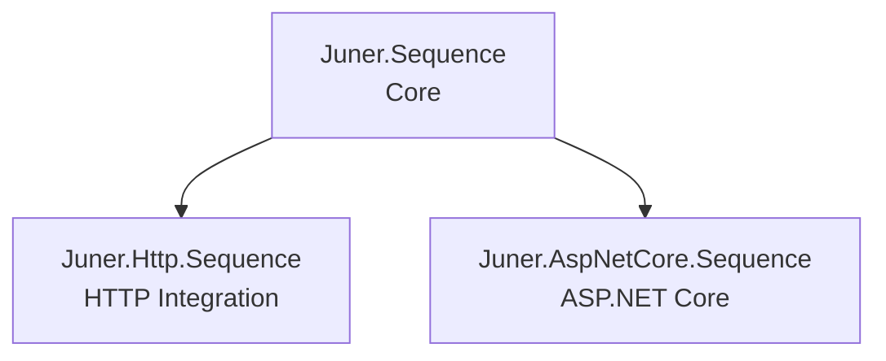

# Juner.Sequence

[](https://www.nuget.org/packages/Juner.Sequence/)
[](https://www.nuget.org/packages/Juner.Http.Sequence/)
[](https://www.nuget.org/packages/Juner.AspNetCore.Sequence/)
[](https://github.com/juner/Sequence/actions/workflows/test.yml)

High-performance streaming JSON serialization for .NET using `IAsyncEnumerable<T>`.  
Ideal for large datasets, real‑time APIs, and memory‑efficient processing.

Supports modern streaming‑friendly JSON formats:

- **NDJSON** (`application/x-ndjson`)
- **JSON Lines** (`application/jsonl`)
- **JSON Sequence** (`application/json-seq`)

Built on top of `System.Text.Json` with an **AOT‑friendly**, **zero‑allocation**, and **layered** design.

---

## Packages

| Package | Description |
|--------|-------------|
| **Juner.Sequence** | Core streaming serializer (no HTTP dependency) |
| **Juner.Http.Sequence** | `HttpClient` / `HttpContent` integration |
| **Juner.AspNetCore.Sequence** | ASP.NET Core input/output streaming support (no dependency on the HTTP package) |

---

## Features

- ⚡ High‑performance streaming JSON
- 🔄 Full `IAsyncEnumerable<T>` support  
- 🧩 Multiple streaming formats (NDJSON / JSON Lines / JSON Sequence)  
- 🛡️ AOT‑friendly (`JsonTypeInfo<T>`‑based API; no reflection)  
- 🧼 Clean and layered architecture  
- 🌐 HTTP and ASP.NET Core integration

---

## Architecture



The architecture is intentionally layered:

- `Juner.Sequence` is the core and has **no HTTP dependencies**.  
- `Juner.Http.Sequence` adds **HttpClient** integration.  
- `Juner.AspNetCore.Sequence` integrates directly with **ASP.NET Core** without depending on the HTTP package.

---

## Quick Start

### JsonSerializerContext (AOT-safe)

```csharp
[JsonSerializable(typeof(MyType))]
public partial class MyJsonContext : JsonSerializerContext { }
```

---

### Serialize (NDJSON)

```csharp
await SequenceSerializer.SerializeAsync(
    stream,
    source,
    MyJsonContext.Default.MyType,
    SequenceSerializerOptions.JsonLines,
    cancellationToken);
```

### Deserialize (streaming)

```csharp
await foreach (var item in SequenceSerializer.DeserializeAsyncEnumerable(
    stream,
    MyJsonContext.Default.MyType,
    SequenceSerializerOptions.JsonLines,
    cancellationToken))
{
    Console.WriteLine(item);
}
```

---

## HttpClient Integration

```csharp
var request = new HttpRequestMessage(HttpMethod.Post, url)
     // Content-Type is set automatically
    .WithNdJsonContent(source, MyJsonContext.Default.MyType);

var response = await httpClient.SendAsync(request);

await foreach (var item in response.Content.ReadJsonLinesAsyncEnumerable<MyType>(
    MyJsonContext.Default.MyType))
{
    Console.WriteLine(item);
}
```

---

## API Design

### AOT-safe API (Recommended)

- No reflection  
- Fully compatible with Native AOT  
- Uses `JsonTypeInfo<T>`

### Convenience API

- Based on `JsonSerializerOptions`  
- May require reflection  
- Not guaranteed to be AOT-safe  

---

## Supported Streaming Formats

| Format | Content-Type | Option |
|--------|--------------|--------|
| NDJSON | application/x-ndjson | `JsonLines` |
| JSON Lines | application/jsonl | `JsonLines` |
| JSON Sequence | application/json-seq | `JsonSequence` |

*(JSON Array intentionally omitted — see Note below.)*

---

## Notes on JSON Array Support

> **Note on JSON Arrays**  
> `application/json` (JSON arrays) is **not** a streaming format and is not supported by the core library.  
> However, `Juner.AspNetCore.Sequence` accepts JSON arrays **only** for:
>
> - Minimal API model binding (`Sequence<T>`)  
> - `SequenceResults.Sequence(source)`  
>
> This is provided for convenience and is not part of the core streaming format set.

---

## License

MIT License  
See the `LICENSE` file for details.

---

## Links

- Repository: https://github.com/juner/Sequence
