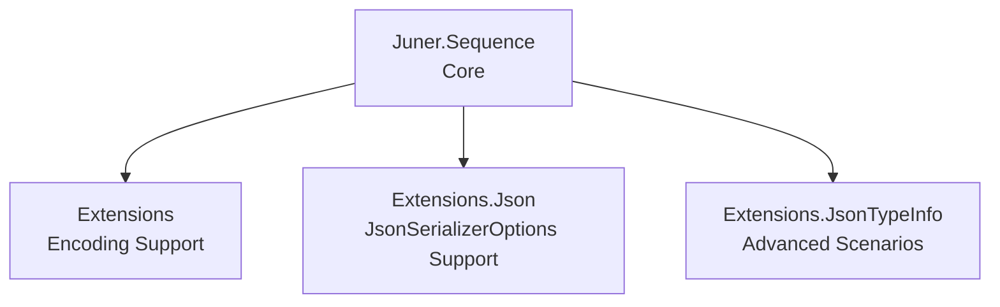

# Juner.Sequence

High​‑performance, AOT-friendly streaming serializer for record-oriented JSON formats in .NET.

Record-oriented formats represent a sequence of independent JSON values,
rather than a single JSON array.

`Juner.Sequence` provides zero‑allocation, fully streaming serialization and deserialization for **record‑oriented JSON formats**, including:

- **NDJSON** (`application/x-ndjson`)
- **JSON Lines** (`application/jsonl`)
- **JSON Text Sequences** (RFC 7464, `application/json-seq`)

Built on top of `System.Text.Json` and `System.IO.Pipelines`, designed for:

- 🚀 High performance (minimal allocations)
- 🔒 AOT compatibility (`JsonTypeInfo<T>`‑based)
- 🔄 True streaming via `IAsyncEnumerable<T>`
- 🧱 Clean, layered architecture

---

## Installation

```bash
dotnet add package Juner.Sequence
```

---

## Quick Start

### JsonSerializerContext (AOT‑safe)

```csharp
[JsonSerializable(typeof(MyType))]
public partial class MyJsonContext : JsonSerializerContext { }
```

---

### Serialize (NDJSON / JSON Lines)

```csharp
// Serialize 
await SequenceSerializer.SerializeAsync(
    writer,
    source,
    MyJsonContext.Default.MyType,
    SequenceSerializerOptions.JsonLines,
    cancellationToken);
```

### Deserialize (streaming)

```csharp
await foreach (var item in SequenceSerializer.DeserializeAsyncEnumerable(
    reader,
    MyJsonContext.Default.MyType,
    SequenceSerializerOptions.JsonLines,
    cancellationToken))
{
    Console.WriteLine(item);
}
```

---

## AOT‑Friendly Design

`Juner.Sequence` is built around:

```csharp
JsonTypeInfo<T>
```

instead of `JsonSerializerOptions`.

### Why?

- No runtime reflection  
- Native AOT compatible  
- Faster and more predictable metadata generation  

---

## Runtime Behavior

### .NET 9 or later
`SequenceSerializer` writes directly to `PipeWriter` using `JsonSerializer.SerializeAsync`, providing the fastest possible path.

### .NET 8 or earlier
Serialization falls back to a stream‑based implementation:

```csharp
writer.AsStream()
```

This ensures compatibility, though it may introduce additional allocations
compared to the PipeWriter-based fast path.

---

## SequenceSerializerOptions

`SequenceSerializerOptions` defines how records are framed during serialization and deserialization.

### Built‑in presets

| Name | Description |
|------|-------------|
| `JsonSequence` | RFC 7464 (`RS` + JSON + `LF`) |
| `JsonLines` | NDJSON / JSON Lines ( JSON + `LF`) |

### Invalid Options

A valid sequence format must define at least one start or end delimiter.  
Options that define **no framing** are considered **invalid** and are not supported.

The library contains an internal default value used only for initialization,  
but it is not available for public use.

---

## FlushStrategy

Controls how flushing is performed during serialization.

| Strategy | Behavior |
|----------|----------|
| `None` | Caller or transport controls flushing |
| `PerRecord` | Flush after each record (default) |

`PerRecord` improves real‑time behavior but reduces throughput.

`PerRecord` is useful for real-time streaming scenarios (e.g. logs, HTTP streaming),
while `None` maximizes throughput in batch processing.

---

## Framing Engine (Core Feature)

The deserializer uses optimized fast‑paths for common formats:

- **NDJSON / JSON Lines**  
  (`Start = empty`, `End = 1 byte`)

- **JSON Sequence**  
  (`Start = 1 byte`, `End = 1 byte`)

For custom formats, it falls back to a general delimiter‑matching engine that supports:

- Multiple start delimiters  
- Multiple end delimiters  
- Variable‑length delimiters  
- Longest‑match semantics  

The final frame is handled separately, with optional support for ignoring incomplete frames.

---

## Performance (Detailed)

100,000 items of `MyType` were serialized using NDJSON streaming, JSON array (buffered),
and a baseline `IAsyncEnumerable<T>` iteration across .NET 7–10.

| Runtime | NDJSON Streaming | JSON Array | Iterate (Baseline) |
|--------|------------------:|-----------:|--------------------:|
| net7   | 70.24 ms          | 20.42 ms   | 50.27 ms            |
| net8   | 59.49 ms          | 15.25 ms   | 46.24 ms            |
| net9   | 58.27 ms          | 13.10 ms   | 44.47 ms            |
| net10  | 52.50 ms          | 11.61 ms   | 41.34 ms            |

### Notes

- NDJSON streaming includes both enumeration and write cost  
- JSON array is fastest due to contiguous buffered writes  
- All runtimes improve significantly from .NET 7 → 10  
- Full BenchmarkDotNet output is available in `/benchmarks/BENCHMARKS.md`

---

## Optional Extensions

### JsonTypeInfo (non‑generic) Extensions — *advanced use only*

These extensions allow passing a non‑generic `JsonTypeInfo`:

```csharp
using Juner.Sequence.Extensions;

await SequenceSerializer.SerializeAsync(
    writer,
    source,
    (JsonTypeInfo)myTypeInfo,
    SequenceSerializerOptions.JsonLines);
```

> ⚠️ Not recommended for general use.  
> Not AOT‑safe and will throw if the provided `JsonTypeInfo` does not match `T`.

---

### JsonSerializerOptions Support — *not guaranteed AOT‑safe*

These extensions resolve metadata via `JsonSerializerOptions.TypeInfoResolver`:

```csharp
using Juner.Sequence.Extensions.Json;

await SequenceSerializer.SerializeAsync(
    writer,
    source,
    jsonSerializerOptions,
    SequenceSerializerOptions.JsonLines);
```

> ⚠️ May rely on reflection and is **not guaranteed to be AOT‑safe**.

---

### JsonSerializerOptions.Default Support — *explicitly not AOT‑safe*

Convenience APIs using `JsonSerializerOptions.Default`:

```csharp
using Juner.Sequence.Extensions.Json;

await SequenceSerializer.SerializeAsync(
    writer,
    source,
    SequenceSerializerOptions.JsonLines);
```

These APIs are annotated with:

- `RequiresUnreferencedCode`
- `RequiresDynamicCode`

> ⚠️ **Explicitly not AOT‑safe.**

---

### Encoding Support (AOT‑safe)

Supports non‑UTF‑8 encodings via transcoding streams:

```csharp
using Juner.Sequence.Extensions;

await SequenceSerializer.SerializeAsync(
    writer,
    source,
    typeInfo,
    SequenceSerializerOptions.JsonLines,
    Encoding.UTF32);
```

UTF‑8 uses the fast path with no overhead.

---

### Stream‑based Extensions (AOT‑safe)

Convenience APIs for working directly with `Stream`:

```csharp
using Juner.Sequence.Extensions;

await SequenceSerializer.SerializeAsync(
    stream,
    source,
    typeInfo,
    SequenceSerializerOptions.JsonLines);
```

Internally uses `PipeReader.Create(stream)` for deserialization.

---

## Supported Formats

| Format | Content-Type | Notes |
|--------|--------------|-------|
| NDJSON | application/x-ndjson | newline‑delimited |
| JSON Lines | application/jsonl | equivalent to NDJSON |
| JSON Sequence | application/json-seq | RFC 7464 (RS‑delimited) |

---

## About JSON Array (`application/json`)

JSON arrays are already well supported by `JsonSerializer` for stream-based scenarios.

Juner.Sequence is designed specifically for record-oriented streaming formats,
where each JSON value can be processed independently.

For this reason, JSON arrays are intentionally not supported.

---

## Architecture



---

## When to Use

- Processing large JSON streams  
- Building high‑performance pipelines  
- Targeting Native AOT  
- Working with `PipeReader` / `PipeWriter`  

## When NOT to Use

- Small payloads → `JsonSerializer` is simpler  
- JSON arrays → use `JsonSerializer`  
- Native AOT scenarios → avoid `JsonSerializerOptions.Default` (not AOT‑safe)

---

## License

MIT
