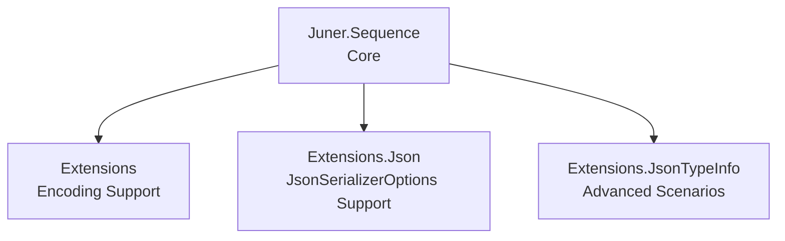

# Juner.Sequence

High‑performance, AOT‑friendly streaming serializer for record‑oriented JSON formats in .NET.

Record‑oriented formats represent a sequence of independent JSON values,
rather than a single JSON array.

`Juner.Sequence` provides zero‑allocation, fully streaming serialization and deserialization for **record‑oriented JSON formats**, including:

- **NDJSON** (`application/x-ndjson`)
- **JSON Lines** (`application/jsonl`)
- **JSON Text Sequences** (RFC 7464, `application/json-seq`)

Built on top of `System.Text.Json` and `System.IO.Pipelines`, designed for:

- 🚀 High performance (minimal allocations)
- 🔒 AOT compatibility (`JsonTypeInfo<T>`‑based)
- 🔄 True streaming via `IAsyncEnumerable<T>`
- 🧱 Clean, layered architecture

---

## Installation

```bash
dotnet add package Juner.Sequence
```

---

## Quick Start

### JsonSerializerContext (AOT‑safe)

```csharp
[JsonSerializable(typeof(MyType))]
public partial class MyJsonContext : JsonSerializerContext { }
```

### Serialize (NDJSON / JSON Lines)

```csharp
await SequenceSerializer.SerializeAsync(
    writer,
    source,
    MyJsonContext.Default.MyType,
    SequenceSerializerOptions.JsonLines,
    cancellationToken);
```

### Deserialize (streaming)

```csharp
await foreach (var item in SequenceSerializer.DeserializeAsyncEnumerable(
    reader,
    MyJsonContext.Default.MyType,
    SequenceSerializerOptions.JsonLines,
    cancellationToken))
{
    Console.WriteLine(item);
}
```

---

## AOT‑Friendly Design

`Juner.Sequence` is built around:

```csharp
JsonTypeInfo<T>
```

instead of `JsonSerializerOptions`.

### Why?

- No runtime reflection  
- Native AOT compatible  
- Faster and more predictable metadata generation  

---

## Runtime Behavior

### .NET 9 or later
Uses the optimized **PipeWriter‑based fast path**, avoiding intermediate buffering and providing the highest throughput.

### .NET 8 or earlier
Falls back to a **Stream‑based implementation** via:

```csharp
writer.AsStream()
```

This ensures compatibility, though it may introduce additional allocations compared to the PipeWriter fast path.

---

## SequenceSerializerOptions

Defines how records are framed during serialization and deserialization.

### Built‑in presets

| Name | Description |
|------|-------------|
| `JsonSequence` | RFC 7464 (`RS` + JSON + `LF`) |
| `JsonLines` | NDJSON / JSON Lines (JSON + `LF`) |

### Invalid Options

A valid sequence format must define at least one start or end delimiter.  
Options that define **no framing** are considered **invalid** and are not supported.

---

## FlushStrategy

Controls how flushing is performed during serialization.

| Strategy | Behavior |
|----------|----------|
| `None` | Caller or transport controls flushing |
| `PerRecord` | Flush after each record (default) |

`PerRecord` improves real‑time behavior but reduces throughput.

---

## Framing Engine (Core Feature)

The deserializer uses optimized fast‑paths for common formats:

- **NDJSON / JSON Lines**  
- **JSON Sequence (RFC 7464)**  

For custom formats, it falls back to a general delimiter‑matching engine supporting:

- Multiple start delimiters  
- Multiple end delimiters  
- Variable‑length delimiters  
- Longest‑match semantics  

---

# Performance

Juner.Sequence provides predictable, memory‑efficient streaming for NDJSON,  
JSON Lines, and JSON Text Sequences.

To help users understand real‑world performance, we benchmarked the library on:

- **Desktop CPU**: Intel Core i5‑9400 (Coffee Lake, 6C/6T, 65W)  
- **Laptop CPU**: Surface Book 3 — Intel Core i7‑1065G7 (Ice Lake, 4C/8T, 15W)

These represent common environments for .NET developers and production workloads  
(servers, laptops, CI runners, cloud VMs, containers).

Benchmarks were executed using BenchmarkDotNet with 100,000 items of `MyType`.

---

## Summary (Serialize — NDJSON vs JSON Array)

### NDJSON Serialize (Streaming)

| Runtime | Desktop (i5‑9400) | Laptop (Surface Book 3) |
|--------|-------------------:|-------------------------:|
| .NET 10 | 50.7 ms | 102.3 ms |
| .NET 9  | 58.7 ms | 79.6 ms |
| .NET 8  | 59.0 ms | 66.0 ms |
| .NET 7  | 70.0 ms | 90.1 ms |

**Observations**

- NDJSON streaming is CPU‑bound and scales with core performance  
- Low‑TDP CPUs (laptops, cloud VMs) show ~2× slower throughput  
- Still provides stable, record‑by‑record output with constant memory usage

---

### JSON Array Serialize (System.Text.Json)

| Runtime | Desktop | Laptop |
|--------|--------:|-------:|
| .NET 10 | 11.1 ms | 13.2 ms |
| .NET 9  | 15.0 ms | 15.0 ms |
| .NET 8  | 16.0 ms | 16.5 ms |
| .NET 7  | 18.0 ms | 18.8 ms |

**Observations**

- JSON arrays are fastest due to contiguous buffered writes  
- Performance is similar across CPUs because the work is burst‑heavy  
- Requires full buffering of the entire dataset (not streaming)

---

## Summary (Deserialize — NDJSON vs JSON Array)

### NDJSON Deserialize (Streaming)

| Runtime | Desktop (i5‑9400) | Laptop (Surface Book 3) |
|--------|-------------------:|-------------------------:|
| .NET 10 | 99.9 ms | 197.3 ms |
| .NET 9  | 102.0 ms | 150.5 ms |
| .NET 8  | 110.0 ms | 139.1 ms |
| .NET 7  | 120.0 ms | 155.3 ms |

**Observations**

- NDJSON parsing is Utf8JsonReader‑heavy and CPU‑bound  
- Laptop CPUs show ~1.5–2× slower performance  
- Memory usage remains constant regardless of dataset size

---

### JSON Array Deserialize (System.Text.Json)

| Runtime | Desktop | Laptop |
|--------|--------:|-------:|
| .NET 10 | 48.8 ms | 64.1 ms |
| .NET 9  | 59.7 ms | 59.7 ms |
| .NET 8  | 60.3 ms | 60.3 ms |
| .NET 7  | 70.5 ms | 70.5 ms |

**Observations**

- JSON array deserialization is fast but requires full buffering  
- Performance is more stable across CPUs  
- Not suitable for unbounded or streaming scenarios

---

## System.Text.Json — Async Streaming (JSON Array Only)

`DeserializeAsyncEnumerable<T>()` provides record‑by‑record streaming  
**but only for JSON arrays**.

| Runtime | Desktop | Laptop |
|--------|--------:|-------:|
| .NET 10 | 37.5 ms | 38.4 ms |
| .NET 9  | 52.4 ms | 52.4 ms |
| .NET 8  | 60.6 ms | 60.6 ms |
| .NET 7  | 67.9 ms | 67.9 ms |

**Observations**

- Very fast, but limited to JSON arrays  
- Cannot read NDJSON / JSON Lines / JSON Sequence  
- Still requires the entire array structure to be valid before streaming begins

---

## Key Takeaways

- **JSON arrays are fastest** but require full buffering and high memory usage  
- **NDJSON streaming is slower** but provides:
  - constant memory usage  
  - record‑by‑record processing  
  - suitability for unbounded or real‑time data  
- **Laptop / cloud CPUs amplify the difference**  
  - NDJSON shows ~2× slower performance on low‑TDP CPUs  
  - JSON arrays degrade less because they rely on burst throughput  
- **PipeWriter / PipeReader optimizations help on .NET 9+**  
  but may not benefit low‑TDP CPUs

---

## Full Benchmark Output

The complete BenchmarkDotNet output (all runtimes, all methods)  
is available in:

```
/benchmarks/BENCHMARKS.md
```

---

## Optional Extensions (Advanced)

### JsonTypeInfo (non‑generic) Extensions

```csharp
using Juner.Sequence.Extensions;

await SequenceSerializer.SerializeAsync(
    writer,
    source,
    (JsonTypeInfo)myTypeInfo,
    SequenceSerializerOptions.JsonLines);
```

> ⚠️ Not recommended for general use.  
> Not AOT‑safe and will throw if the provided `JsonTypeInfo` does not match `T`.

---

### JsonSerializerOptions Support (not guaranteed AOT‑safe)

```csharp
using Juner.Sequence.Extensions.Json;

await SequenceSerializer.SerializeAsync(
    writer,
    source,
    jsonSerializerOptions,
    SequenceSerializerOptions.JsonLines);
```

> ⚠️ May rely on reflection and is **not guaranteed to be AOT‑safe**.

---

### JsonSerializerOptions.Default Support (explicitly not AOT‑safe)

```csharp
using Juner.Sequence.Extensions.Json;

await SequenceSerializer.SerializeAsync(
    writer,
    source,
    SequenceSerializerOptions.JsonLines);
```

Annotated with:

- `RequiresUnreferencedCode`
- `RequiresDynamicCode`

> ⚠️ **Explicitly not AOT‑safe.**

---

### Encoding Support (AOT‑safe)

```csharp
using Juner.Sequence.Extensions;

await SequenceSerializer.SerializeAsync(
    writer,
    source,
    typeInfo,
    SequenceSerializerOptions.JsonLines,
    Encoding.UTF32);
```

UTF‑8 uses the fast path with no overhead.

---

### Stream‑based Extensions (AOT‑safe)

```csharp
using Juner.Sequence.Extensions;

await SequenceSerializer.SerializeAsync(
    stream,
    source,
    typeInfo,
    SequenceSerializerOptions.JsonLines);
```

Internally uses `PipeReader.Create(stream)` for deserialization.

---

## Supported Formats

| Format | Content-Type | Notes |
|--------|--------------|-------|
| NDJSON | application/x-ndjson | newline‑delimited |
| JSON Lines | application/jsonl | equivalent to NDJSON |
| JSON Sequence | application/json-seq | RFC 7464 (RS‑delimited) |

---

## About JSON Array (`application/json`)

JSON arrays are already well supported by `JsonSerializer` for stream‑based scenarios.

Juner.Sequence is designed specifically for **record‑oriented streaming formats**,  
where each JSON value can be processed independently.

For this reason, **JSON arrays are intentionally not supported**.

---

## Architecture



---

## When to Use

- Processing large JSON streams  
- Building high‑performance pipelines  
- Targeting Native AOT  
- Working with `PipeReader` / `PipeWriter`  

## When NOT to Use

- Small payloads → `JsonSerializer` is simpler  
- JSON arrays → use `JsonSerializer`  
- Native AOT scenarios → avoid `JsonSerializerOptions.Default` (not AOT‑safe)

---

## License

MIT
